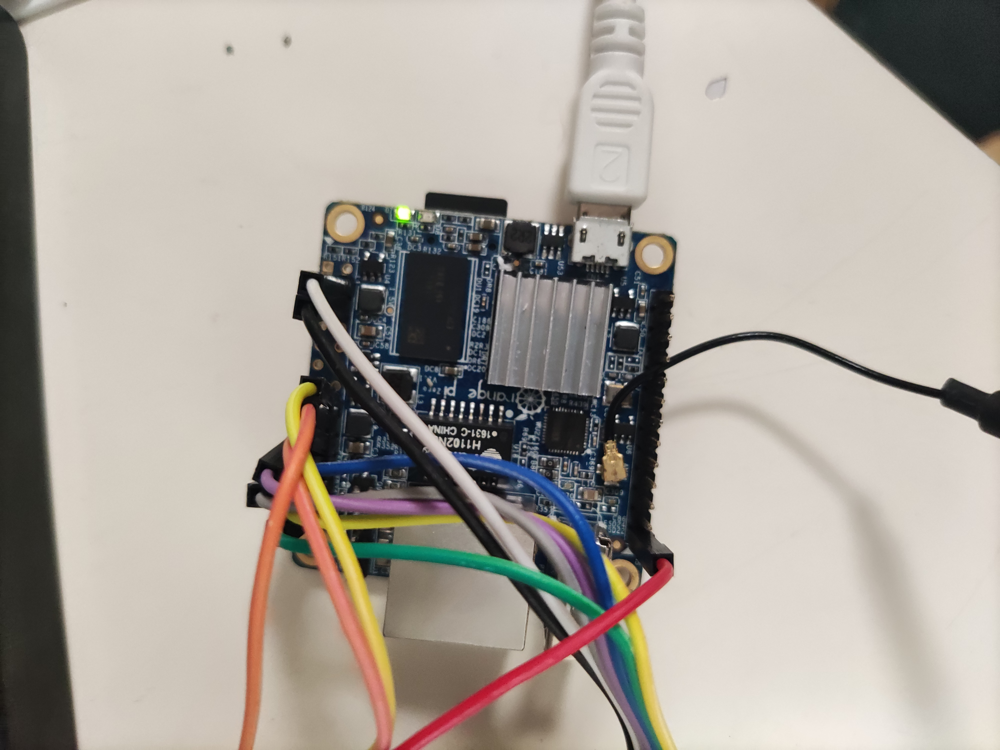

# orangepi-iot

## Description
We use an orangepi zero to poll and display crypto currency market info and weather forcase report from remote http server using wifi, and with help of a sht30 sensor adding to orangepi i2c driver, we can also get realtime temperature and humidity.

## Introduction
We have three destinations currently:  
*  Poll  crypto currency market info from remote [http server](http://coinmarketcap.com/).
*  Poll weather forcast report from remote [http server](http://www.weather.com.cn).
*  Use a sensor to capture local temperature and humidity in realtime.
  
## Preparation

* Orangepi zero development kit with ubuntu 20.04 system installed as a server.
* A 1.8 inch(resolution 128x160) LCD with st7735 driver.  
* sht30 temperature and humidity sensor, we use GT-HT30 to replace it as their pins are compatible.
* Orangepi can access internet  by wireless. if not, configure file /etc/network/interfaces as belows.
```bash
auto lo
iface eth0 inet dhcp
auto wlan0
allow-hotplug wlan0
iface wlan0 inet dhcp
gateway $your_router_ip
dns-nameservers $your_router_ip
wpa-ssid "your WIFI name"
wpa-psk $psk-info
```
$psk-info can be generated by run cmd `wpa_passphrase $wifi_name $wifi_password`, if wpa_passphrase not installed, you can run `sudo apt install wpasupplicant` to install it.

* Enable SPI in linux kernel.  
   Edit /boot/orangepiEnv.txt to add line :
   ```txt
   overlays=spi-spidev
    param_spidev_spi_bus=1
   ```
Then reboot orangepi. if you see spi device like belows, means spi module has beein installed successfully.
```
root@orangepi:~# ls /dev/spi*
/dev/spidev1.0
```
Edit /boot/orangepiEnv.txt to add line :
   ```txt
   overlays=spi-spidev
    param_spidev_spi_bus=1
   ```
* Enable I2C driver in linux kernel.
   Edit /boot/orangepiEnv.txt to add line :
   ```txt
   overlays=i2c0 i2c1
   ```
Then reboot orangepi. if you see i2c device like belows, means i2c module has beein installed successfully.
```
root@orangepi:~# ls /dev/i2c*
/dev/i2c-0 /dev/i2c-1
```

If you want to enable both i2c and spi, overlays can be set like belows:
```
root@orangepi:~# ls /dev/i2c*
overlays=spi-spidev i2c0 i2c1
```

## Installation steps

### 1. Install python dependence.
   ```bash
   sudo python3 -m pip install OPi.GPIO spidev Pillow numpy
   sudo python3 -m pip install st7735
   ```
If installing numpy has error, you can use following cmd:
```
apt-get install python3-numpy
```

### 2. As st7735 package only supports raspberry by default, We modify st7735 __init__.py code in pip packages to support orangepi. 
   
```.py
   import RPi.GPIO as GPIO    ->   import OPi.GPIO as GPIO
```

### 3. Connect LCD to orangepi gpio pins:

 |  Screen Pin|	Orange pi Pin|
 |--|--|
|GND	| Ground (pins 6, 9, 14, 20, 25, 30, 34 or 39)|
|VCC	|5v Power (pins 2 or 4)|
|SCL	|GPIO 11 (pin 23)|
|SDA	|GPIO 10 (pin 19)|
|RES	|GPIO 25 (pin 22)|
|DC	|GPIO 26 (pin 7)|
|CS	|GPIO 8 (pin 24)|
|BL	|Not connected|

If you want to your own defined pins, you can find all pins mapping gpio info [here](https://pinout.xyz/), if you do that, you also need to change 
 st7735 GPIO number in the code.  

### 4. Test LCD module by run  python file.
   ```bash
   python3 lcd_test.py
   ```
If there are words displyed in LCD, congratulations! LCD has been installed successfully!

### 5. Connect sht30 sensor to orangepi i2c device
You can connect 4 pins of sht30 to i2c0 or i2c1. You can test and get i2c address by running:
```
i2cdetect -y 0
#or 
i2cdetect -y 1
``` 
to test if i2c device has been configured successfully.
 
Connected lines are as belows:



### 6. Install smbus 
We use smbbus to connect i2c device, so install it:
```
apt-get install python3-smbus
```
### 7. Test sht30 sensor
 ```bash
   python3 sht30_test.py
   ```
### 8. Add chinese font support, you can put your font libraray.

### 9. Test all code.
    
```bash
   python3 orangepi-iot.py
```

### 10. Final result shows as belows.


